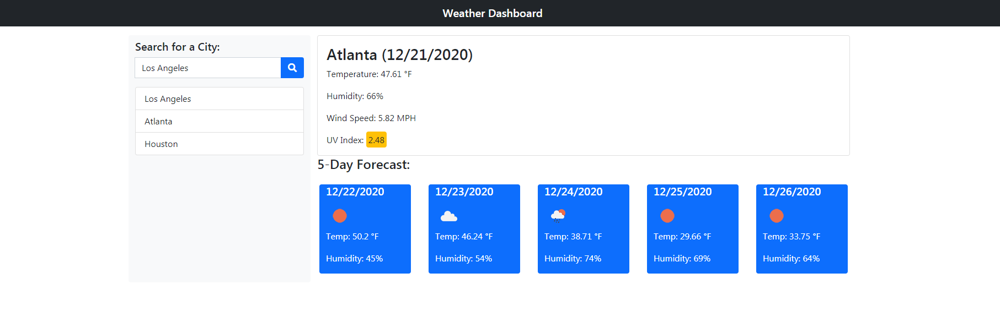

# Weather Forecaster

## Repository

This repository hosts all files to run a weather forecaster page.  It includes the HTML and JavaScript files used on the page.

## Table of Contents
* [Weather Forecaster](#weather_forecaster)
* [Installation](#installation)
* [Usage](#usage)
* [Development Roadmap](#development_roadmap)
* [Contributing to the Daily Planner](#contributing)
* [License](#license)

## Weather Forecaster

Site link: [https://udunomancer.github.io/gt-ft-weather-forecaster/](https://udunomancer.github.io/gt-ft-weather-forecaster/)

This Forecaster contains one page, where a user can search for cities and view the current and five day forecast for that city.

## Installation

If you'd like to use this page as a template, feel free to fork the repository at [https://github.com/Udunomancer/gt-ft-weather-forecaster](https://github.com/Udunomancer/gt-ft-weather-forecaster)

## Usage

* The page should allow a user to search for a city
* When the user searches for a city,
    * Then they should be presented with the current forecast
    * Then they should be presented with a five day forecast
    * The city should be saved in local storage
* When a user clicks on a city saved to local storage, they should be presented with the forecasts for that city

## Development Roadmap

**Initial Repository/Site Build (12/21/2020)**
* Added html file to repository
* Built working JavaScript to load page and present forecasts for searched cities

**Future Roadmap**
* Add functionality for saving/printing forecasts
* Add functionality for picking what forecast items are important to user and displaying those

## Contributing to the Weather Forecaster

No direct contributions to repository accepted at this time.

## License

[License](assets/license.txt)